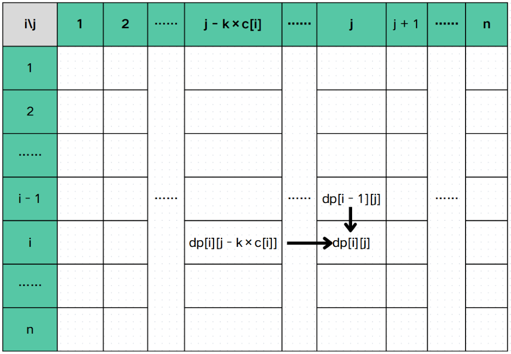

# 背包
在C++中，​**背包问题（Knapsack Problem）​**​ 是一个经典的优化问题，主要用于在**资源受限条件下进行价值最大化决策**，核心思想是通过**动态规划**来实现的。

为了更好的理解不同的背包之间的区别，在讲一种背包之前我们会先看一个例子。

---
## 01 背包

>题目简介：有 $N$ 个物品和一个容量为 $W$ 的背包，每个物品价值为 $v_i$， 重量为 $c_i$ 。在选出若干个物品在满足容量不超过 $W$ 时，求最大价值是多少？

这是最基础的背包问题，观察后发现每个物品要么选（1），要么不选（0），所以我们通常称这种题型为 01背包。

### 思路
我们可以定义一个状态：$dp_{i, j}$ 代表前 $i$ 个物品选恰好重量为 $j$ 时，可以获得的最大价值。那么决策显然为两个：选或不选。如果选择装入当前物品，那么我们需要让背包腾出至少 $c_i$ 个容量用于装这个物品，而价值则加上这个物品的价值，即 $v_i$。如果不选择装入当前物品，那么就是同样的空间装前 $i - 1$ 个物品。

我们可以画一个表格来直接的理解：


通过整理和表格我们发现状态转移如下：
$$
dp[i][j] = \max \begin{cases}
dp[i - 1][j]
\newline
dp[i - 1][j - c[i]] + v[i]
\end{cases}
$$
### Code
下面是一个 01背包在转移时的代码：
```cpp
for (int i = 1; i <= n; i++) {
	for (int j = c[i]; j <= W; j++) {
		dp[i][j] = max(dp[i - 1][j], dp[i - 1][j - c[i]] + v[i])
	}
}
```
### 复杂度
这样的时间复杂度是 $O(NW)$，空间复杂度为 $O(NW)$。
### 优化（滚动数组）
01 背包的时间复杂度是不可优化的了，而空间复杂度可以优化为 $O(W)$ ，这个时候我们就需要使用滚动数组了。
#### 观察
通过观察发现 $dp_{i, j}$ 只可能是从上一行而且不超过这一列转移过来。具体来说 $dp_{i, j}$ 只可能是从 $dp_{u, v}$ 转移过来且 $1 \le u \le i - 1, \ 1 \le v \le j$ 。所以我们可以把 $N$ 行压成 1 行，但是我们需要倒序来保证不把之前的覆盖。

#### Code
下面是一个使用了滚动数组的 01背包：
```cpp
for (int i = 1; i <= n; i++) {
	for (int j = W; j >= c[i]; j--) {
		dp[j] = max(dp[j], dp[j - c[i]] + v[i]);
	}
}
```
#### 复杂度
时间复杂度无法进行优化，即 $O(NW)$ ，空间复杂度为 $O(W)$
### 总结
01 背包是一个只有两个决策（选或不选）的背包。

状态转移：**扣除花费获得价值**。

---
## 完全背包

> 题目简介：有 $N$ **种**物品和一个容量为 $W$ 的背包， **每种物品可以拿任意个**，每种物品价值为 $v_i$， 重量为 $c_i$ 。在选出若干个物品在满足容量不超过 $W$ 时，求最大价值是多少？

观察上面题目发现跟 01 背包有些区别，这次变成了有 $W$ 种，然后每种可以去任意个数。这种没有数量限制的题目我们统称为完全背包。
### 思路
我们发现完全背包非常类似 01 背包。而不同的是，01 背包的决策是要或者不要，但是完全背包的决策是要 0 个， 要 1 个， $\cdots$  要 $\lfloor \frac{W}{c[i]} \rfloor$ 个。具体来说就是要 `k` 个且 $0 \le k \le \lfloor \frac{W}{c[i]} \rfloor$ 。我们定义 `dp[i][j]` 代表前 `i` 个物品选恰好重量为 `j` 时，可以获得的最大价值。我们可以画出下面的表格来辅助我们理解转移：


转移如下：
$$
dp[i][j] = \max \begin{cases} 
dp[i-1][j] \newline
dp[i][j - k \times c[i]] + k \times v[i]
\end{cases}
\quad
\begin{array}{l} 
0 \leq k \leq \frac{W}{c[i]} \newline
k \times c[i] \leq j 
\end{array}
$$
### Code
下面为完全背包的转移时的代码
```cpp
for (int i = 1; i <= n; i++) {
	for (int j = 0; j <= W; j++) {
		dp[i][j] = dp[i - 1][j];
		
		for (int k = 0; k <= W / c[i]) {
			dp[i][j] = max(dp[i][j], dp[i][j - k * c[i]] + k * v[i]);
		}
	}
}
```
### 复杂度
时间复杂度为 $O(N{W} ^ {2})$，是比较大的。空间复杂度为 $O(NW)$
### 优化 
#### 思路
先观察 01 背包和完全背包在二维下转移的区别，发现一个是可以从
 01 背包滚动数组后需要倒序是为了保证 $dp_i$ 是从状态 $dp_{i - 1, j - c_i}$ 转移而来，而完全背包是可以从自己这一行转移过来，所以 $for$ 循环需要顺序写来保证可以从 $dp_{i, j - k \ c_i}$  转移而来。

#### Code
下面是滚动数组后的完全背包：
```cpp
for (int i = 1; i <= n; i++) {
	for (int j = 0; j <= W; j++) {
		dp[j] = max(dp[j], dp[j - c[i]] + v[i]);
	}
}
```

#### 复杂度
我们发现之前的双重循环的时间复杂度是 $O(N{W}^{2})$ 而，优化后的时间复杂度是 $O(NW)$ 。

空间复杂度从 $O(NW) \to O(W)$ 。

---
## 多重背包

> 题目简介：有 $N$ **种**物品和一个容量为 $W$ 的背包， 每种物品可以**拿 $m_i$ 个**，每种物品价值为 $v_i$， 重量为 $c_i$ 。在选出若干个物品在满足容量不超过 $W$ 时，求最大价值是多少？

这次题目给定了 $N$ 中物品和每种物品可拿的数量，我们通常将这种类型的背包叫做**多重背包**。多重背包更完全背包的唯一区别就是完全背包的每种物品可拿无限个，而多重背包的每种物品有一个限制。

### 思路
完全背包是通过枚举一个 $k$ 来表示拿 $k$ 个，而这个 $k$ 的上限是 $\frac{W}{c[i]}$。而多重背包的上限题目已给出，即 $m_i$ 。所以转移就是完全背包的转移将  的上限替换为 $m_i$ 就可以了。

$$
dp[i][j] = \max \begin{cases}
dp[i - 1][j] \newline 
dp[i][j - k \times c[i]] + k \times v[i]
\end{cases}
\quad
\begin{array}{l} 
0 \leq k \leq m[i] \newline
k \times c[i] \leq j 
\end{array}
$$

### Code
下面是多重背包转移时的代码：
```cpp
for (int i = 1; i <= n; i++) {
	for (int j = 0; j <= W; j++) {
		for (int k = 0; k <= m[i]; k++) {
			if (k * c[i] <= j) 
				dp[i][j] = max(dp[i][j], dp[i - 1][j - k * c[i]] + k * v[i]);
		}
	}
}
```

当然，我们也可以使用滚动数组来优化我们空间复杂度：
```cpp
for (int i = 1; i <= n; i++) {
	for (int j = W; j >= 0; j--) {
		for (int k = 0; k <= m[i]; k++) {
			if (k * c[i] <= j) 
				dp[j] = max(dp[j], dp[j - k * c[i]] + k * v[i]);
		}
	}
}
```
### 复杂度
这个使用了三重循环，所以时间复杂度为 $O(W \sum\limits_{i = 1}^{N}{m_i})$ 。

空间复杂度在没有使用滚动数组前为 $O(NW)$ ，使用滚动数组后为 $O(W)$ 。时间复杂度过高，显然是可以优化的。

### 二进制优化
二进制优化是一种将多重背包转换为 01 背包的巧妙方法，大幅降低算法的时间复杂度。这种优化利用了**二进制表示的特性**，将物品拆分后用 01 背包的方法解决。

> 我们通过二进制拆分，将**物品数量限制**转化为**物品组合选择**，从而将多重背包问题转化为01背包问题，来优化时间。

#### 思路
在枚举 $k$ 时，会发现枚举次数为 $m_i$ ，这非常慢。所以考虑把 $k$ 用若干个数的和表示出来， 然后使用 01 背包思路解决，而二进制刚好可以表示出来。所以我们尝试把 $m_i$ 件商品拆成若干个二的幂和一个剩余的数之和，这样 $k$ 就一定可以被表示出来，而且拆成的物品少，仅为 $\lceil \log_{2}{m[i]} \rceil$ 件。

所以我们将一个数拆成以下形式：

$$
2^0 + 2^1 + 2^2 + \cdots + 2^x + \text{Remain}
$$
**注：$\text{Reamin}$ 表示剩余部分。**

我们也可以通过以下图片来助于我们理解，下面图片展示了把一个数拆成上面所说的格式。左下角为二的整数次幂，右下角是剩余的数量。


#### Code
以下是一个使用了二进制优化的多重背包的核心代码，二进制优化将多重背包转为 01 背包，可以使用滚动数组。

1. 定义变量
```cpp
int n, newn, W; // newn 初始值为0
int c[MAXN], v[MAXN], m[MAXN];
int newc[MAXN * 30], newv[MAXN * 30]; // 这里开题目要求的数量 * log(m[i]) 就可以了
int dp[MAXN * 30][MAXW]; 
```

2. 二进制优化 + 转移
```cpp
for (int i = 1; i <= n; i++) {
	int tmp = m[i];
	int p = 1;
	
	while (p <= tmp) {
		newn++;
		newc[newn] = c[i] * p;
		newv[newm] = v[i] * p;

		tmp -= p;
		p *= 2;
	}

	if (tmp > 0) {
		newn++;
		newc[newn] = c[i] * tmp;
		newv[newn] = v[i] * tmp;
	}
}

// 普通01背包
for (int i = 1; i <= newn; i++) {
	for (int j = newc[i]; j <= W; j++) {
		dp[i][j] = max(dp[i - 1][j], dp[i - 1][j - newc[i]] + newv[i]);
	}
}
```

转移时也可以使用滚动数组：
```cpp
// 滚动数组后的01背包
for (int i = 1; i <= n; i++) {
	for (int j = W; j >= newc[i]; j--) {
		dp[j] = max(dp[j], dp[j - newc[i]] + newv[i]);
	}
}
```
#### 复杂度
二进制优化大大降低了时间复杂度，从之前的 $O(W \sum\limits_{i = 1}^{N}{\text{m}_i})$ 优化到了 $O(W \sum\limits_{i = 1}^{n}{\log{m_i}})$ 。~~时间是否可以进一步的优化呢？~~

空间复杂度在未滚动数组时为 $O(NW)$，在滚动数组后为 $O(W)$ 。

### 单调队列优化
单调队列优化通过将动态规划的状态转移过程转化为滑动窗口最大值的一个优化方法。这可以使得我们的时间复杂度降低至 $O(NW)$ ，而进一步优化我们的代码。

#### 思路
按照朴素的多重背包我们可以推出这个点是由哪些点转移而来，如下图：

观察后发现 $DP[j] = \max(DP[j - k \ w_i], DP[j - (k - 1) \ w_i], \cdots, DP[j - w_i])$  ，简化后就是 $DP[j]$ 从 $DP[j - k \ w_i]$ 转移而来。而我们可以观察到的一个重要 的性质就是 $j$ 和 $j - k \ w_i$ 同余，也就是 $j$ 和 $k \ w_i$ 同余。所以我们可以按照模 $w_i$ 进行分组，相同余数的分乘同一组，如下图（每一行一个组）：


我们发现组与组之间无转移关系，所以这个这个状态只可能是从同一组的某一个区间转移而来。假如 $r + k \ w_i = j$ ，其中 $r$ 代表 $j$ 模 $w_i$ 的余数。那么这个点的转移范围就是 $[r + (k - m_i) \ w_i, r + (k - 1) \ w_i]$ 。**注意物品数量有限，不能拿大于 $m_i$ 个物品。**

在这里我们发现有区间的最值转移，所以我们容易想到使用单调队列。这样我们每个组都使用单调队列转移，就可以求出答案了。

#### Code
下面是单调队列优化多重背包的核心代码。
1. 变量定义
```cpp
struct Q {
    int u, val;
} q[MAXW];

int n, W;
int dp[MAXW];
int c[MAXN], v[MAXN], m[MAXN];
int head, tail; // 单调队列的首和尾
```
2. 核心代码
```cpp
for (int i = 1; i <= n; i++) {
	for (int r = 0; r < c[i]; r++) { // 枚举模数
		head = tail = 0;
		int j = (W - r) / c[i]; // 算出最多的数量

		for (int k = 0; j <= j; j++) {
			while (head < tail && q[head].u < k - m[i]) head++;
			while (head < tail && dp[r + k * c[i]] - k * v[i] >= q[tail - 1].val) tail--;

			q[tail].u = k;
			q[tail].val = dp[r + k * c[i]] - k * v[i];
			tail++;

			dp[r + k * c[i]] = max(dp[r + k * c[i]], q[head].val + k * v[i]);
		}
	}
}
```

#### 复杂度
单调队列优化多重背包将多重背包的时间复杂度将至 $O(NW)$ 。

空间复杂度在未使用滚动数组时为 $O(NW)$ ，使用滚动数组后为 $O(W)$ 。

---

## 混合背包

> 题目简介：有 $N$ 种物品和一个容量为 $W$ 的背包， **有些物品只有一个，有些有无限个，还有一些有 $m_i$ 个**，每种物品价值为 $v_i$， 重量为 $c_i$ 。在选出若干个物品在满足容量不超过 $W$ 时，求最大价值是多少？

这种问题一般统称为混合背包。混合背包一般是 01 背包，完全背包和混合背包组成。

### 思路
混合背包结合了三种背包的问题，那么思路就是三种背包的代码混合起来，这个点是哪种背包就按照哪种背包做。

### Code
下面是混合背包的核心代码：
```cpp
for (int i = 1; i <= n; i++) {
	if (m[i] == 1) { // 01背包
		for (int j = W; j >= c[i]; j--) 
			dp[j] = dp[j - c[i]] + v[i];
	} else if (m[i] == -1) { // 完全背包（假设m[i] = -1）代表有无限个
		for (int j = c[i]; j <= W; j++) 
			dp[j] = dp[j - c[i]] + v[i];
 	} else { // 多重背包
		head = tail = 0;
		int j = (W - r) / c[i]; // 算出最多的数量

		for (int k = 0; j <= j; j++) {
			while (head < tail && q[head].u < k - m[i]) head++;
			while (head < tail && dp[r + k * c[i]] - k * v[i] >= q[tail - 1].val) tail--;

			q[tail].u = k;
			q[tail].val = dp[r + k * c[i]] - k * v[i];
			tail++;

			dp[r + k * c[i]] = max(dp[r + k * c[i]], q[head].val + k * v[i]);
		}
	}
}
```
### 复杂度
因为混合背包包含是三种背包的合体，那么时间复杂度就应该是三种背包里最大的内个，而三种背包的时间复杂度都是 $O(NW)$ ，所以混合背包的时间复杂度为 $O(NW)$ 。

空间复杂度为$O(W)$ 。

---
## 分组背包
> 题目简介：有 $N$ **组**物品和一个容量为 $W$ 的背包， **每组包含 $m_i$ 个物品，每组要么选其中一个物品要么不选**，每种物品价值为 $v_i$， 重量为 $c_i$ 。在选出若干个物品在满足容量不超过 $W$ 时，求最大价值是多少？

将物品分组的背包叫分组背包，特点是将物品分组，每组要么选其中一个物品要么不选。

### 思路
思考后发现我们可以按照组转移，那么这组物品只可能从之前转移而来，所以我们枚举这组物品选哪个（也可以不选），转移既可。

### Code
以下是分组背包的核心代码：
```cpp
for (int i = 1; i <= n; i++) { // 枚举组
	for (int j = 0; j <= W; j++) {
		for (int k = 1; k <= m[i]; k++) {
			if (j >= c[i]) dp[j] = max(dp[j], dp[j - c[i]] + v[i]);
		}
	}
}
```

### 复杂度
时间复杂度为 $O(N^2W)$，空间复杂度在滚动数组后为 $O(W)$ 。