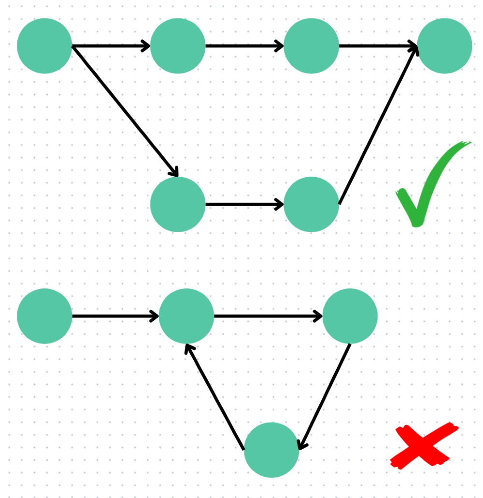

${\rm DAG~(Directed~Acyclic~Graph)}$ 是指有向无环图，是一种由顶点（节点）和有向边组成的图结构，满足以下两个核心特性：
1. 有向性：边具有方向，表示顶点之间的顺序关系。如：边 $u \to v$ 指的是顶点 $u$ 必须在顶点 $v$ 前处理。
2. 无环性：图中不存在任何环路（无法从某个点出发，经过$\ge1$条边回到自身）。如：若存在路径 $\rm u \to \rm v \to \rm w$ ，则构成了环，则该图不是 $\rm DAG$。
