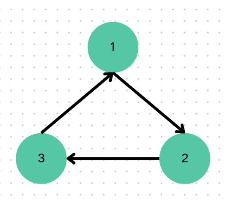

拓扑排序 ${\rm (Topological~sorting)}$ 是给一个有向无环图也就是 $\rm DAG$ 所有的点进行一个排序。假设在一个 `DAG` 里有两个点 `u`，`v` 使得有一条有边，则称 `v` 依赖于 `u` 。拓扑排序的目标是将所有点按照某一个顺序排序，使得排在后面的点不再被依赖于前面的点。

## Khan 算法
### 观察
#### DAG中的拓扑序列
在`DAG` 中发现一个入度为 `0` 的点一定不会被依赖，所以我们可以先将入度为 `0` 的点放在拓扑排序序列的最前面。

接下来，所有被依赖于所有入度为 `0` 的点会加入拓扑排序序列，因为依赖它们的顶点已经在序列里了。

然后，所有被依赖于所有被依赖于所有入度为 `0`的点会加入$\dots$

$\vdots$
最后，没有点入度为 `0`，拓扑排序结束。
我们发现依次访问的顺序就是拓扑排序序列。

#### 有向图（可能有环）
如果是一个有向图（可能有环）会发生什么事情呢？我们分析下面的例子：


我们可以发现下面的例子进行到第 0 步时入度都不为 0，直接结束了，如果拓扑排序结束而且还有点没有被访问，那就说明这个图有环。
### 总结
#### 拓扑排序序列
每次找到图中入度为 0 的点，删除这个点和这个点所被依赖的边。重复以上操作直到没有入度为 0 的点。访问的顺序就是构造的拓扑排序序列
#### 判环
如果在拓扑排序某一步结束了，而且还有点没被访问，说明此图有环。
### Code 
先存所有一开始入度为0的点，放入一个队列 `q` 里。然后一次取出入度为 `0` 的点也就是`u`，删去依赖于`u`的点`v`与点 `u`的边使得 `v`的入度 `-1`。如果 `v` 的入度为 `0` ，加入队列 `q` 并重复此操作。
```cpp
vector<int> g[MAXN]; // 邻接表
int indegree[MAXN]; // 每一个点的入度
queue<int> q; // 队列

vector<int> topsort() {
	for (int i = 1; i <= n; i++) {
		for (auot j : g[i]) { // 一条i -> j的边
			d[j]++;
		}
	}

	for (int i = 1; i <= n; i++) {
		if (d[i] == 0) q.push(i); // 加入入度为0的点
	}

	vector<int> topseq;
	while (!q.empty()) {
		int u = q.front();
		q.pop();

		topseq.push_back(u); // 将节点u加入拓扑排序序列

		for (auto v : g[u]) {
			d[v]--;
			if (d[v] == 0) q.push(v);
		}
	}

	return topseq; // 返回拓扑排序序列
}
```
## 拓扑排序 + DP 
拓扑排序是有一个特定的便利顺序的，所以我们可以想到在上面进行 DP 的转移。
### 例题题解
#### P10166 [DTCPC 2024] 环
##### 题目描述
给定一张 $n$ 个点 $m$ 条边的有向图 $G$ ，每个点有点权 $a_i$ ，建立一条 $u \to v$ 的边需要花费 $a_u + a_v$ 。问成环的最小代价。

##### 思路
如果给定图已成环，那么答案为 0 。否则一定需要加边，那么我们最终的图会变成以下的结构：

## 有要求的拓扑排序
待更新
## 例题
以下是拓扑排序的经典简单的题目：
- <a href="https://www.luogu.com.cn/problem/B3644" target="_blank">B3644 【模板】拓扑排序/家谱树）</a>
- <a href="https://www.luogu.com.cn/problem/P4017" target="_blank">P4017 最大食物链计数</a>
- <a href="https://www.luogu.com.cn/problem/P1347" target="_blank" >P1347 排序</a>