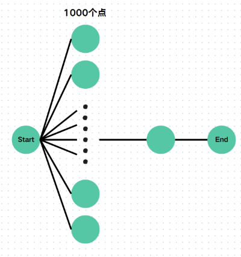
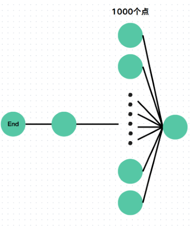

# BFS
广度优先搜索 (Breadth First Search) ，字面意思就是由广度优先的搜索方式。DFS是使用的 “不撞南墙不回头”，BFS 使用的是哪个店离自己距离越近，就先搜索那个点。

BFS 的实现是利用队列 `Queue` 来实现的，每次加入离自己距离最近的点，然后依次取出队列头进行相同的操作。下面是一个 BFS 的基本框架：

```cpp
#include <bits/stdc++.h>
using namespace std;

const int MAXN = 10005;

int vis[MAXN], dis[MAXN];
queue<int> q; // BFS需要的队列
vector<int> g[MAXN]; // 这里使用邻接表存储，也可以使用其他的存储方式。

void bfs(int st) {
	vis[st] = 1, dis[st] = 0;
	q.push(st);

	while (!q.empty()) {
		int u = q.front();
		q.pop();

		for (auto v : g[u]) { // v为下一个节点
			if (!vis[v]) {
				vis[v] = 1;
				dis[v] = dis[u] + 1;
				q.push(v);
			}
		}
	}
}
```
## 优化1：双向搜索
### 观察
在普通 `BFS` 时我们经常是从起点一点一点加边到终点。在加边的过程中，我们不管有多少边，就都都加进去了。但是遇到这样的图，我们就可能会超时：


这样发现，如果我们从终点开始搜索会更快，于是 `BFS` 改为从终点 $\to$ 起点，于是我们又遇到了一个问题，如果图张这样，那么我们还是会超时：


但是这样我们又发现，这样从起点开始比较好，更快。

### 总结
总结发现在写 `BFS` 时，不能直接从起点或终点出发，否则会遇到上面两种情况，会导致 `TLE`。

所以使用双向搜索来优化 `BFS`，这个用法是在优化 `BFS` 时可能要使用的，实现是从两侧展开分枝，哪边分枝少就从哪边展开。

### Code
下面是使用了双向搜索优化的 `BFS` 代码：
```cpp
#include <bits/stdc++.h>
using namespace std;

int main() {

	return 0;
}
```
# 0-1BFS / 双端队列 BFS
## 问题
现在有一个问题，题目描述如下：

>有一张 `n` 个点 `m` 条边的无向图，边权为 0 或 1，问从节点 1 到节点 `n` 的最短距离。

## 观察
这道题**仅有**两个边权的可能性，如果我们使用 `BFS` ，那么会有问题 $\to$ 答案不是最优解（因为边权可能不一样），所以我们需要先让边权较小者（0）进入，而边权较大者后入（1），这个时候就可以使用 `01BFS` 了。

双端队列 BFS 就是使用双端队列的 `BFS`，可以实现有两种花费的路径进行 `BFS`，具体实现是用一个双端队列，将花费较小的元素放在队列前端，花费较大的放在尾端，这样维持了 `BFS` 的单调性，满足了 `BFS` 的基本需求。
## 总结
发现边权只有两个可能性，而使用 `01BFS` 来维护单调性，使得答案正确。
## Code
下面是一份用 `01BFS` 的主要框架。
```cpp
#include <bits/stdc++.h>
using namespace std;

const int MAXN = 1e5 + 5;

struct E {
	int v, w; // v是下一个节点，w是边权
};

vector<E> g[MAXN]; // 假设使用邻接表存储
deque<int> q; // 创建一个双端队列
int vis[MAXN], dis[MAXN];
void bfs(int st) {
	for (int i = 1; i <= n; i++) dis[i] = (int)1e9;
	vis[st] = 1;
	dis[st] = 0;
	q.push_front(st);

	while (!q.empty()) {
		int u = q.front();
		q.pop_front();

		for (auto e : g[u]) {
			int v = e.v, w = e.w;

			if (vis[v]) continue;
			vis[v] = 1;

			dis[v] = dis[u] + w;
			if (w == 0) q.push_front(v);
			else q.push_back(v);
		}
	}
}
```
## 时间复杂度
## BFS
## 双向搜索优化BFS
## 01-BFS

|||
| --- | --- |
|||

- <a href="https://www.luogu.com.cn/problem/P1141" target="_blank" rel="noopener noreferrer">
    P1141 01迷宫
</a>
- <a href="https://www.luogu.com.cn/problem/P4554" target="_blank" rel="noopener noreferrer">
    P4554 小明的游戏
</a>
- <a href="https://www.luogu.com.cn/problem/P1332" target="_blank" rel="noopener noreferrer">
    P1332 血色先锋队
</a>
- <a href="https://www.luogu.com.cn/problem/P1849" target="_blank" rel="noopener noreferrer">
    P1849 [USACO12MAR] Tractor S
</a>
- <a href="https://www.luogu.com.cn/problem/CF590C" target="_blank" rel="noopener noreferrer">
    CF590C Three States
</a>