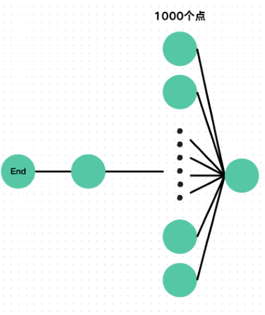

# 双向搜索
这一章会总结两个东西：双向同时搜索和 `Meet in the middle`。

## 双向同时搜索
优化1：双向搜索
### 观察
在普通 `BFS` 时我们经常是从起点一点一点加边到终点。在加边的过程中，我们不管有多少边，就都都加进去了。但是遇到这样的图，我们就可能会超时：


这样发现，如果我们从终点开始搜索会更快，于是 `BFS` 改为从终点 $\to$ 起点，于是我们又遇到了一个问题，如果图张这样，那么我们还是会超时：


但是这样我们又发现，这样从起点开始比较好，更快。

### 总结
总结发现在写 `BFS` 时，不能直接从起点或终点出发，否则会遇到上面两种情况，会导致 `TLE`。

所以使用双向搜索来优化 `BFS`，这个用法是在优化 `BFS` 时可能要使用的，实现是从两侧展开分枝，哪边分枝少就从哪边展开。

### Code
下面是使用了双向搜索优化的 `BFS` 代码：
```cpp
#include <bits/stdc++.h>
using namespace std;

int main() {

	return 0;
}
## Meet in the middle